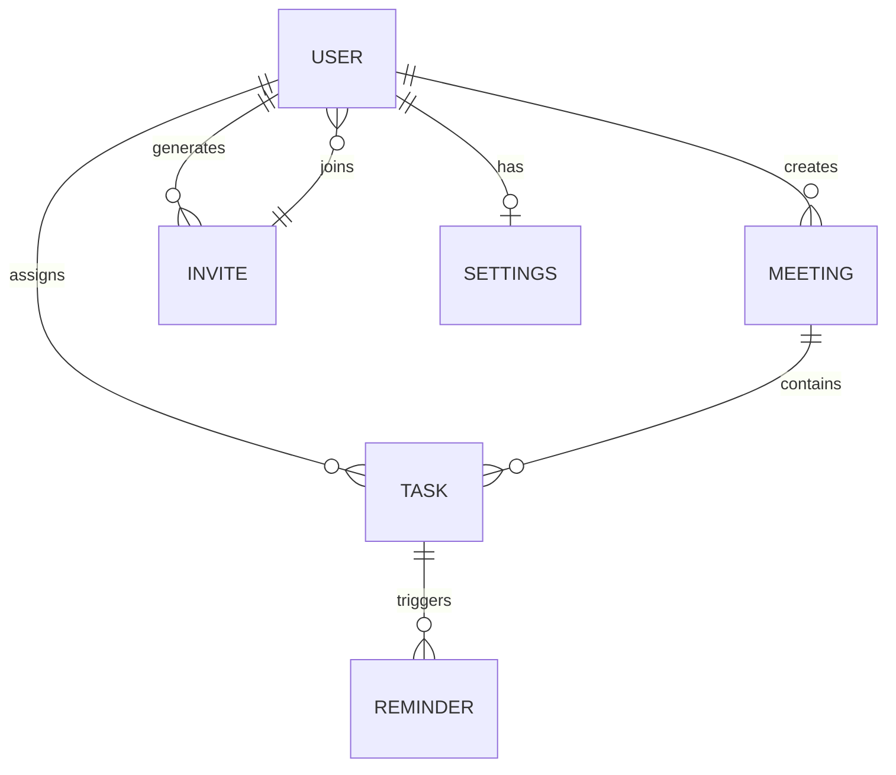

<div align="center">

# 🚀 MeetFlow AI

### AI-Powered Meeting Intelligence & Follow-Up Agent

[](https://nextjs.org)
[](https://prisma.io)
[](https://tailwindcss.com)
[](https://typescriptlang.org)
[](#)

**Transform meeting transcripts into actionable tasks in seconds — powered by 9 AI providers.**

[Live Demo](https://meetflow-ai.vercel.app) · [Report Bug](https://github.com/DangerRohit84/Meetflow/issues) · [Request Feature](https://github.com/DangerRohit84/Meetflow/issues)

</div>

---

## 📋 Table of Contents

- [About](#about)
- [Features](#features)
- [Tech Stack](#tech-stack)
- [AI Providers](#ai-providers)
- [Getting Started](#getting-started)
- [Environment Variables](#environment-variables)
- [Database Schema](#database-schema)
- [Project Structure](#project-structure)
- [API Endpoints](#api-endpoints)
- [Contributing](#contributing)
- [License](#license)

---

## 🔍 About

MeetFlow AI is an intelligent meeting assistant that automatically extracts actionable tasks, deadlines, decisions, and assignees from meeting transcripts. Built with Next.js 16, it supports **9 AI providers** and features a modern glassmorphism UI with dark/light mode.

### The Problem

- Teams waste **4+ hours weekly** manually extracting action items from meeting notes
- **30% of follow-up tasks** fall through the cracks without proper tracking
- No existing tool offers AI-powered extraction from raw transcripts

### Our Solution

**Paste transcript → AI extracts tasks → Team gets notified**

---

## ✨ Features

| Feature | Description |
|---------|-------------|
| 🤖 **Multi-Provider AI** | Support for Groq, OpenAI, Anthropic, Gemini, DeepSeek, Mistral, Together, OpenRouter, and custom APIs |
| 📋 **Smart Extraction** | AI extracts tasks, deadlines, assignees, priorities, and key decisions |
| 👥 **Team Collaboration** | Invite members via link, assign tasks, track progress |
| 📊 **Analytics Dashboard** | Visual insights into task completion rates and team productivity |
| 🌙 **Glassmorphism UI** | Modern dark/light theme with smooth animations |
| 🔒 **Enterprise Security** | JWT httpOnly cookies, bcrypt hashing, rate limiting, input sanitization |
| 📱 **Responsive Design** | Works seamlessly on desktop, tablet, and mobile |
| 🔗 **Invite System** | Generate shareable links with 7-day expiry for team members |

---

## 🛠 Tech Stack

| Category | Technology |
|----------|------------|
| **Framework** | [Next.js 16.2](https://nextjs.org) (App Router + Turbopack) |
| **Language** | [TypeScript 5.0](https://typescriptlang.org) |
| **Styling** | [Tailwind CSS 4.0](https://tailwindcss.com) |
| **UI Components** | [shadcn/ui](https://ui.shadcn.com) |
| **Database** | [PostgreSQL](https://www.postgresql.org) via [Neon](https://neon.tech) |
| **ORM** | [Prisma 5.22](https://prisma.io) |
| **Authentication** | JWT with httpOnly cookies + bcrypt |
| **AI Integration** | Custom multi-provider system |
| **Deployment** | [Vercel](https://vercel.com) |

---

## 🤖 AI Providers

MeetFlow AI supports **9 AI providers** with free and paid model options:

| Provider | Free Models | Paid Models | Key Feature |
|----------|-------------|-------------|-------------|
| **Groq** | — | Llama 3.3 70B, GPT-OSS 120B, Qwen 3.6 27B | Fastest inference |
| **OpenAI** | — | GPT-5.6, GPT-4o, o3 | Most popular |
| **Anthropic** | — | Claude Fable 5, Opus 4, Sonnet 4 | Best analysis |
| **Google Gemini** | Flash, Lite | 2.5 Pro, 1.5 Pro | Multimodal |
| **DeepSeek** | — | V3 Chat, R1 Reasoner | Affordable |
| **Mistral** | Nemo, Mixtral | Large, Small, Codestral | European |
| **Together AI** | — | Llama 3.3 70B, Qwen 2.5 72B | Open-source hosting |
| **OpenRouter** | 16 models | 200+ models | Unified API |
| **Custom** | Any OpenAI-compatible API | — | Ollama, LM Studio |

---

## 🚀 Getting Started

### Prerequisites

- [Node.js 18+](https://nodejs.org)
- [Neon account](https://neon.tech) (free PostgreSQL database)
- [Vercel account](https://vercel.com) (for deployment)

### Installation

```bash
# Clone the repository
git clone https://github.com/DangerRohit84/Meetflow.git
cd Meetflow

# Install dependencies
npm install

# Set up environment variables
cp .env.example .env.local
# Edit .env.local with your values

# Push database schema
npx prisma db push

# Seed the database
npx prisma db seed

# Start development server
npm run dev
```

Open [http://localhost:3000](http://localhost:3000) in your browser.

### Demo Credentials

| Email | Password | Role |
|-------|----------|------|
| alex@meetflow.ai | password123 | Team Lead |
| sarah@meetflow.ai | password123 | Member |
| david@meetflow.ai | password123 | Member |
| emma@meetflow.ai | password123 | Member |

---

## 🔐 Environment Variables

| Variable | Required | Description |
|----------|----------|-------------|
| `DATABASE_URL` | ✅ | PostgreSQL connection string (Neon) |
| `JWT_SECRET` | ✅ | Secret key for JWT tokens |
| `NEXT_PUBLIC_APP_URL` | ✅ | Your deployed URL |
| `GROQ_API_KEY` | ❌ | Groq API key |
| `SMTP_HOST` | ❌ | Email SMTP host |
| `SMTP_PORT` | ❌ | Email SMTP port |
| `SMTP_USER` | ❌ | Email SMTP username |
| `SMTP_PASS` | ❌ | Email SMTP password |

> ⚠️ **Note:** AI API keys are configured per-user in the Settings page, not in environment variables.

---

## 📊 Database Schema



**Models:** User, Meeting, Task, Invite, Reminder, Settings

---

## 📁 Project Structure

```
meetflow-ai/
├── prisma/
│   ├── schema.prisma          # Database schema
│   └── seed.ts                # Seed data
├── src/
│   ├── app/
│   │   ├── (auth)/
│   │   │   ├── login/         # Login page
│   │   │   └── register/      # Register page
│   │   ├── api/
│   │   │   ├── auth/          # Authentication endpoints
│   │   │   ├── ai/extract/    # AI extraction endpoint
│   │   │   ├── meetings/      # Meeting CRUD
│   │   │   ├── tasks/         # Task CRUD
│   │   │   ├── members/       # Team members
│   │   │   ├── invite/        # Invite system
│   │   │   └── settings/      # User settings
│   │   ├── dashboard/
│   │   │   ├── page.tsx       # Dashboard home
│   │   │   ├── meetings/      # Meeting management
│   │   │   ├── tasks/         # Task management
│   │   │   ├── members/       # Team members
│   │   │   ├── analytics/     # Analytics dashboard
│   │   │   └── settings/      # User settings
│   │   └── page.tsx           # Landing page
│   ├── components/ui/         # shadcn/ui components
│   └── lib/
│       ├── auth.ts            # JWT helpers
│       ├── groq.ts            # AI provider integration
│       ├── prisma.ts          # Prisma client
│       └── utils.ts           # Utility functions
├── public/
│   └── grid.svg               # Background pattern
└── package.json
```

---

## 🔌 API Endpoints

### Authentication

| Method | Endpoint | Description |
|--------|----------|-------------|
| `POST` | `/api/auth/register` | Register new user |
| `POST` | `/api/auth/login` | Login user |
| `POST` | `/api/auth/logout` | Logout user |
| `GET` | `/api/auth/me` | Get current user |

### Meetings

| Method | Endpoint | Description |
|--------|----------|-------------|
| `GET` | `/api/meetings` | List meetings |
| `POST` | `/api/meetings` | Create meeting |
| `GET` | `/api/meetings/[id]` | Get meeting |
| `PATCH` | `/api/meetings/[id]` | Update meeting |
| `DELETE` | `/api/meetings/[id]` | Delete meeting |

### Tasks

| Method | Endpoint | Description |
|--------|----------|-------------|
| `GET` | `/api/tasks` | List tasks |
| `POST` | `/api/tasks` | Create task |
| `PATCH` | `/api/tasks/[id]` | Update task |

### AI Extraction

| Method | Endpoint | Description |
|--------|----------|-------------|
| `POST` | `/api/ai/extract` | Extract tasks from transcript |

---

## 🚢 Deployment

### Vercel (Recommended)

1. Push to GitHub
2. Import repository on [Vercel](https://vercel.com/new)
3. Add environment variables
4. Deploy

### Post-Deployment

```bash
# Run seed command in Vercel Functions terminal
npx prisma db seed
```

---

## 🤝 Contributing

Contributions are welcome! Please follow these steps:

1. Fork the repository
2. Create a feature branch (`git checkout -b feature/amazing`)
3. Commit changes (`git commit -m 'Add amazing feature'`)
4. Push to branch (`git push origin feature/amazing`)
5. Open a Pull Request

---

## 📄 License

This project is licensed under the MIT License — see the [LICENSE](LICENSE) file for details.

---

## 🙏 Acknowledgments

- [Next.js](https://nextjs.org) — The React framework
- [Prisma](https://prisma.io) — Database ORM
- [Tailwind CSS](https://tailwindcss.com) — Utility-first CSS
- [shadcn/ui](https://ui.shadcn.com) — UI components
- [Neon](https://neon.tech) — Serverless PostgreSQL
- [Vercel](https://vercel.com) — Deployment platform

---

<div align="center">

**Built with ❤️ by Alpha Coders Team**

[⬆ Back to Top](#-meetflow-ai)

</div>
